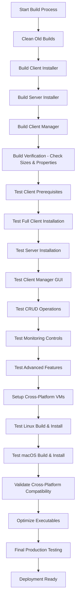

# SysLogger Build and Test Plan

## Current Build Process Analysis

The existing build system uses PyInstaller to create standalone executables:

- **build_installers.bat**: Orchestrates building of client and server installers
- **SysLogger_Client_Installer.spec**: PyInstaller spec for client installer GUI
- **SysLogger_Server_Installer.spec**: PyInstaller spec for server installer GUI

## Required Modifications for Enhanced Installers

### New Component: Client Manager Executable
The `client_manager.py` is a new Tkinter-based GUI application that needs its own executable for production deployment.

**Dependencies identified from code review:**
- tkinter, ttk
- threading, time, json, requests, socket, datetime, webbrowser
- Production-ready configurations: no console, UPX compression, no debug

**Spec file requirements:**
- Entry point: `installation/client_manager.py`
- Hidden imports: tkinter components, requests, json, socket, datetime
- Exclude: PyQt6, PySide6 (GUI uses Tkinter)
- Production settings: console=False, upx=True, debug=False

### Updated Build Script
Add client manager build step to `build_installers.bat`:
```batch
REM Build client manager
echo Building Client Manager...
pyinstaller installation\SysLogger_Client_Manager.spec
```

## Comprehensive Build and Test Plan

### Phase 1: Build Process Enhancement

1. **Create PyInstaller spec for Client Manager**
   - Analyze client_manager.py imports and dependencies
   - Create SysLogger_Client_Manager.spec with proper hidden imports
   - Configure production settings (no console, UPX compression)

2. **Update Build Script**
   - Modify build_installers.bat to include client manager build
   - Ensure error handling and cleanup between builds
   - Add client manager to output listing

3. **Build Verification**
   - Execute full build process on Windows
   - Verify all three executables are generated
   - Check executable properties (size, no console, icons)
   - Test basic launch of each executable

### Phase 2: Installation Testing

#### Client Installer Testing
4. **Prerequisites Check Testing**
   - Verify Python version validation
   - Test psutil, requests, GPUtil availability checks
   - Confirm error handling for missing requirements

5. **Full Installation Workflow**
   - Test system ID generation
   - Verify server discovery mechanism
   - Test client registration with server
   - Confirm monitoring service startup
   - Validate auto-startup configuration
   - Test protection mechanisms setup
   - Check domain update service

#### Server Installer Testing
6. **Server Installation**
   - Test prerequisite checks (Python, Node.js, Docker)
   - Verify PostgreSQL setup and configuration
   - Test domain configuration application
   - Validate startup configuration
   - Confirm protection mechanisms

### Phase 3: Client Manager Testing

7. **GUI Launch and Connectivity**
   - Test application startup without errors
   - Verify server connection and unit loading
   - Check auto-refresh functionality

8. **CRUD Operations**
   - Test adding new clients manually
   - Verify editing existing client details
   - Confirm client deletion with confirmation
   - Validate server API calls for each operation

9. **Monitoring and Control**
   - Test monitoring enable/disable toggle
   - Verify restart functionality
   - Check uninstall instructions generation

10. **Advanced Features**
    - Test client search and filtering
    - Verify real-time updates
    - Check settings dialog for server URL changes
    - Validate clipboard functionality

### Phase 4: Cross-Platform Compatibility

11. **Compatibility Requirements**
    - Review platform-specific code paths in installers
    - Identify Windows, Linux, macOS specific configurations
    - Ensure all platform detection works correctly

12. **Cross-Platform Testing Strategy**
    - Use VirtualBox/VMware for Linux (Ubuntu) and macOS testing
    - Test build process on each platform
    - Validate installation workflows on all platforms
    - Check client manager functionality across platforms
    - Verify service configurations for each OS

### Phase 5: Production Optimization

13. **Executable Optimization**
    - Review and minimize executable sizes
    - Optimize hidden imports to reduce bloat
    - Test UPX compression effectiveness
    - Validate no unnecessary dependencies included

14. **Production Readiness**
    - Ensure comprehensive error handling
    - Verify logging configurations
    - Test graceful failure scenarios
    - Confirm user-friendly error messages
    - Validate uninstallation processes

## Testing Environment Setup

- **Windows Testing**: Current development environment
- **Linux Testing**: Ubuntu VM with systemd
- **macOS Testing**: macOS VM with launchd
- **Network Testing**: Isolated network for server discovery
- **Database Testing**: PostgreSQL instances for server setup

## Success Criteria

- All three executables build successfully on Windows
- Installation workflows complete without errors
- Client manager performs all CRUD operations correctly
- Cross-platform installations work on Linux and macOS
- Executables are production-ready (no console, compressed, functional)
- Error handling is user-friendly and informative

## Risk Mitigation

- Test builds incrementally to avoid full rebuilds on failure
- Maintain backup of working build configurations
- Document platform-specific issues and workarounds
- Implement automated testing where possible

## Build and Test Workflow



**Build Issue Resolution:** Added cleanup step to remove old dist/build directories before building. This resolves permission errors from locked executable files.

## Timeline Estimate

- Phase 1 (Build Enhancement): 2-3 hours
- Phase 2 (Installation Testing): 4-6 hours
- Phase 3 (Client Manager Testing): 3-4 hours
- Phase 4 (Cross-Platform): 6-8 hours
- Phase 5 (Optimization): 2-3 hours

Total: 17-24 hours with cross-platform VMs setup